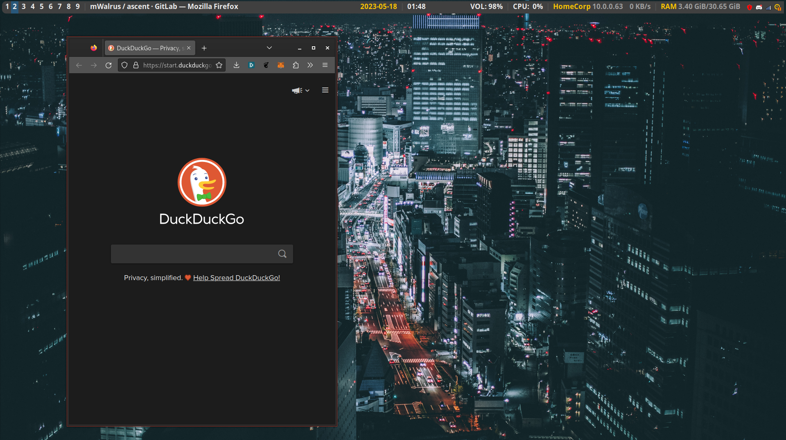

# LeftWM Theme - LateNight

A LeftWM theme for those late night coding sessions.

## Screenshots

## Installation
 1. Clone the repository to your LeftWM config folder: `git clone https://github.com/JacoMalan1/LateNight $HOME/.config/leftwm/themes/LateNight`
 2. Apply theme: `ln -s $HOME/.config/leftwm/themes/LateNight $HOME/.config/leftwm/themes/current`
 3. Reload LeftWM

## Dependencies
 - leftwm
 - feh
 - polybar
 - dunst

## Attribution
The [wallpaper photo](https://unsplash.com/photos/cXU6tNxhub0) was taken by Andre Benz and is to be used under the [Unsplash License](https://unsplash.com/license).
